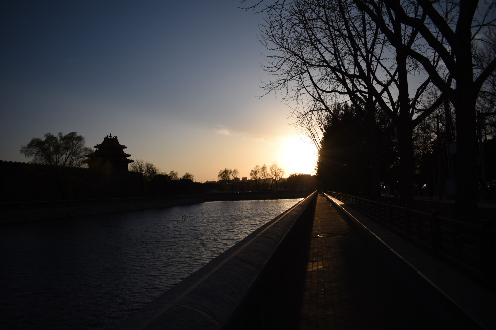
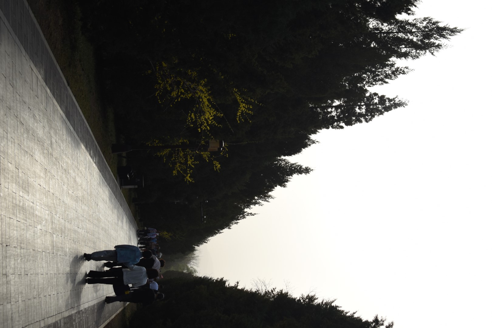
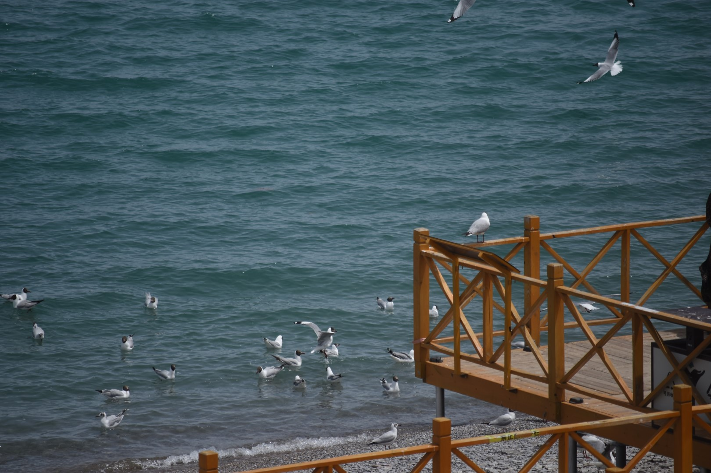

北京这座城市并不欢迎所有的外来者。

这是我第一次正式参加`HPC`比赛。前期并没有太多的准备，原本计划公布的赛题一拖再拖，我原本负责一个线性方程组求解器`hypre`的优化，而后又转到写`HGEMM`，线性代数里的基本算子，我此前确实没听说过，而且比赛平台是`ARMv9`的机器，平时也没有接触过。在老队员帮助下，我们很快写了一份看上去还不错的代码，然后用`SVE`进行了向量化，当时说，后续可以考虑使用`SME`向量化，但是组委会提供的机器居然是`VPS`，而且不支持`SME`，我们没法调试，也埋下了伏笔，我们只能翻`ARM`的文档纸上谈兵看一看，没有学过`ARM`的指令集，也没用过`ACLE`，实在是举步维艰。

”我就要去北京了“，在到达北京之前我一直是这么想的，对于我们这种山村里来的孩子，对遥远的首都还是有不少的向往。当天落地后，首先震撼到我的是大兴机场线的票价，看到了列车后又觉得好像有点合理又好像没那么合理。等我们出了地铁，却发现比赛地是实打实的郊区...

办完手续，我们打车前往市中心，然后就被堵在了路上，不是休息日，也不是早晚高峰，就这么堵起来了，幼小的心灵又一次感受到震撼...

吃完饭，自由活动，我去了天安门外，却发现没有预约连天安门的影子都看不见，又从旁边绕到后面，慢慢在这些胡同与大街之间穿行，在故宫的护城河边的一角感受着日落与晚风，体会着完全不一样的割裂。京沪两地给了我完全不一样的感觉，在上海，每个人都来去匆匆为了自己的生活而奔波，而在北京，你可以明显看到外来者匆匆忙忙，而本地人在胡同口间消磨时间，在四合院外有意无意经营着不大不小的商铺，好不惬意。

与之相对的，我从西南山区的农村花了近20年才来到这里，不知道付出了多少，也不知道多少乡里乡亲根本没机会来到这里，可是，我20年努力争取来的，却只是很多人的起点。

有的人刚出生就在罗马，有的人花了一辈子走到罗马。

之后，和高中同学吃饭，聊天，也许在他们眼中我非常厉害，但我知道自己只是刚好碰巧有了这个机会而已，我并不比别人好多少，何况自己确实刚入门。此事后面还被发到高中班群，我也收获不少鼓励，无论真心与否，但毕竟也都是3年同窗了。

很晚才回到酒店，第二日直接开始比赛。首先是看了看配置，`BMC`，支持`SME`，但是使用`gcc`无法编译`SME`，改成毕昇`(clang)`，也要链接一个祖传的`libgcc`才能编译，但是综合性能会降低，在没有确定使用`SME`之前，我们就用`gcc`调试细节参数，另一边的`hypre`也是没有什么详细的方案，也在调参，甚至快写出一个脚本了...到午饭时间的时候队伍的网络还莫名其妙断了一次，持续了约一个小时，我们也获得了一个小时的补时，但后期并没有太多可做的，主要都在查找`SME`相关的资料，第一天的成绩还算不错。

晚上很晚才吃完饭，回到酒店本来在正常计划第二天的工作，结果组委会突然发消息让我们可以调库，算子优化调库属实有点炸裂，后面又表示调库肯定不如`SME`，估计是看到没人用`SME`急了，我们一开始到处查找合适的库，找不到，后面又决定还是自己写`SME`，然后开始查阅各种资料，有了一些眉目，但是手上没有支持`SME`的机器，还是不清不楚的。

第二天到了赛场，花了些时间把`SME`相关的`ACLE Intrinsic`弄清楚了，大部分队伍都开始使用`SME`，我们很快被甩到了后面，没想到的是，最后卡住我们的是数学上的问题，没人清楚如何把大矩阵分解成小的张量积，直接对一个大矩阵操作显然不现实，对向量寄存器长度的小块矩阵单独进行运算效率也极低，勉强写出来一个版本也过不了正确性校验，期间慌乱中还把`git`给搞炸了，靠发文件手动版本管理😰

最终也没能写出一版合适的方案，只能把昨天的版本交了上去，赛后在酒店复盘，我们的位置基本上已经确定，答辩影响不大了。

不甘也说不上，毕竟第一次，毕竟什么都不懂，但是遗憾总是有的吧，毕竟是第一次，也说不上什么感受。毕竟是第一次。

北方的春天还有一点寒冷，我站在酒店的窗前看着远处缓缓驶过的列车，一切如此安静，悄无声息的就过去了。

第二天答辩，颁奖，没有悬念。结束之后反而不知道干什么了。计划中没想到今天这么早结束，也没有预约什么东西，最终找到圆明园还可以逛一逛就去了。

硕大的园林，有桃红柳绿，也有看不见尽头的长廊。看不到头的，是历史的烟尘，也是我自己的追寻，在迷茫中前进，我真的知道自己需要什么吗。

我不知道。

傍晚，又去了一些地方，市中心，公园，外围。一个人晃来晃去，结果是到处都关门了，只能回酒店，这样，也才勉强赶上地铁末班车。

没想到的是，走出地铁，外面刮起了扬尘。空气中像是熟悉的坚实的泥土的气息，而实际又是陌生且轻浮的沙尘。地上有了一层薄沙，尘埃落定了，不必为过去嗟叹了。

第二天在离开北京的飞机上，我看到了席卷北方大地慢慢流动的沙尘，把空气染成橙黄色。我不知道自己到底要走向何方，但是我的内心告诉我走下去，首都的尘埃落地了，而我心里的尘埃似乎又浮起了，带来无法描述的心情，我知道，我的尘埃还会掀起更大的波澜。

------

5月，在纠结了很久之后，我决定以非正式队员的身份到青海再一次参加比赛。

比赛前两天搭建集群，我并没有太多能做的，后三天，前两天替换上场，把我负责的应用跑掉，最后一天在外面搞后勤，帮忙做现场的应用，最终也就是一个中规中矩的成绩，我则一直在思考，自己到底还有多大的差距。

差距太大了，要学的太多了。

可是自己一直都是这么颓废，放不下什么，更抓不起什么东西，未来啊，现在啊，自己啊...

我试图说服自己自己很棒，自己值得，可是又告诉自己自己不配...

后面几天在西宁周边旅行，青藏高原上有西部熟悉的气息，春夏之交，冻土上已经少见裸露的冰层，不过草原还是接近枯黄的颜色。青海湖上的冰层也已经化开，候鸟成群结队飞舞，在蓝天的背景之上，演绎着自由。

大部分时间，我们开着车，在草原与高山之间奔驰，看着牛羊成群在草甸上漫步，看着刚刚融化的冰水在大地上绘出溪流，看着车尾在无人的高原上扬起的阵阵尘埃。

高原啊，我也是高原的孩子啊。横断山区虽不如青藏高原般巍峨，但破碎的地形足以阻挡人们离开，也足以圈住游子的心。

我们走了，高原上的尘埃也落地了，可高原的孩子到底要走向何方呢？谁都不知道，连那个孩子自己也不知道，走出了重重大山，究竟什么时候能够到自己的星星呢...

>那个飞远的你
>
>去千山外独自前行
>
>是否见到更亮的星
>
>别因规避伤而丢弃
>
>开始的勇气
>
>追忆少时流萤
>
>在记忆里遥不可及
>
>可微光啊
>
>分明在此刻 照亮着你
>
>你长大了	—— 星尘/柯立可
