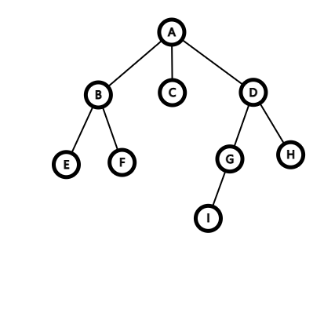
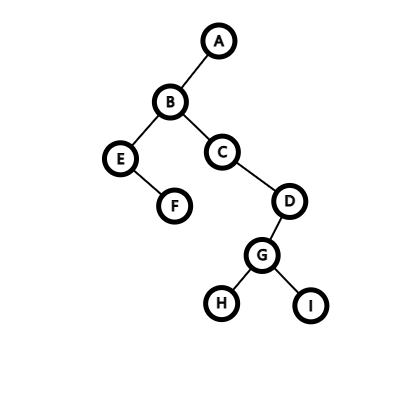

## 1.自由树

连通的、无环的无向图。

自由树$G=(V,E)$有以下性质：

- $G$是一个无向图

- $G$中任何两顶点由唯一简单路径相连

- $G$是连通的，但是从图中移除任意一条边得到的图均不相连

- $G$是连通的，且$\lvert E\rvert = \lvert V\rvert-1$

- $G$是无环的，且$\lvert E\rvert=\lvert V\rvert-1$

- $G$是无环的，但是如果向$E$中添加任何一条边，均会造成图包含一个环

## 2.森林

  一个及以上自由树组成的集合。

  可能不连通的、无环的无向图。

## 3.有根树

### 3.1.定义

有根树是一棵自由树，其顶点中存在一个与其他顶点不同的节点，称该顶点为树的根。

一棵有根树中的任意一个顶点均可以作为这棵树的根。

若无特殊说明，我们通常说的**树**指**有根树**。

### 3.2.常用概念

#### 1 祖先、后代

从一棵树$T$的根节点$r$到任意节点$x$的唯一简单路径上的任意节点$y$称为节点$x$的**祖先**，反之，如果$y$是$x$的祖先，则$x$是$y$的**后代**。

显然，一个节点与自身互为祖先和后代。

如果$x$是$y$的后代，且$x\ne y$，则称$x$是$y$的**真后代**，$y$是$x$的**真祖先**。

#### 2 父节点、子节点、兄弟节点

设从一棵树$T$的根节点$r$到任意节点$x$的唯一简单路径上最后一条边是$(y,x)$，则$y$是$x$的**父节点**，也叫**双亲**，$x$是$y$的**子节点**，也叫**孩子**，如果两个节点有相同的父节点，则它们是**兄弟节点**。

根是树中唯一没有父节点的节点。

#### 3 叶子节点，内部节点

一个没有子节点的节点称为**叶子节点**，非叶子节点为**内部节点**。

#### 4 度

有根树$T$中一个节点$x$的子节点数目为$x$的**度**。

:::note

与图/自由树不同，有根树中除根节点外均有且只有一条连向父节点的边，故有根树中的度仅考虑连向子节点的边，而不是所有边

:::

显然，叶子节点就是度为$0$的节点。

#### 5 深度、高度、层

有根树$T$中从根节点$r$到节点$x$的一条简单路径长度即为$x$的**深度**，从$x$到叶子节点的最长简单路径上边的数目即为$x$的**高度**，树的一个**层**包含了同一深度的所有节点。**树的高度**是指树中节点的**最大深度**。

根节点的深度为$0$，叶子节点的高度为$0$。

#### 6 子树

由有根树$T$中一个节点$x$的所有后代构成的节点称为以$x$为根的子树

### 3.3.有序树

每个节点的子节点都是有序的有根树

## 4.二叉树

### 4.1.定义

二叉树$T$是定义在有限节点集上的结构，它或者不包含任何节点，或者包含三个不相交的节点集合：一个根节点，一棵称为**左子树**的二叉树，一棵称为**右子树**的二叉树。

### 4.2.常用概念

#### 1.左孩子、右孩子

若一个节点左子树非空，则左子树的根为该节点的**左孩子**，若一个节点右子树非空，则右子树的根为该节点的**右孩子**。

二叉树不仅仅是度不超过$2$的有序树的，对于只有一个孩子的节点，区分左孩子和右孩子是必要的。

#### 2.真二叉树

除叶子节点外的节点度均为$2$的二叉树。

#### 3.满二叉树

所有叶子节点深度相同，且所有内部节点度为$2$的二叉树。

:::important

满二叉树（Full Binary Tree）国内外定义存在不同，国外说的满二叉树一般指国内说的真二叉树。

:::

#### 4.完全二叉树

除最后一层，每一层节点数均达到最大值的二叉树。

#### 5.位置树

在一棵**位置树**中，节点的孩子被标记为不同的正整数，不同于有序树，如果没有孩子被标记为整数$$i$$，则该节点的第$i$个孩子缺失。

#### 6.$k$叉树

若对于位置树的每个节点，所有标记大于$k$的孩子均缺失，则称这棵树为**$k$叉树**。

二叉树是$k=2$的$k$叉树。

同理可推出真$k$叉树、满$k$叉树和完全$k$叉树的定义。

### 4.3.二叉树的性质

- 在二叉树的第$i$层上至多有$2^{i-1}$个节点
- 深度为$k$的二叉树至多有$2^k-1$个节点（满二叉树）
- 对于任意一棵二叉树，若叶子数为$n_0$，度为$2$的节点数为$n_2$，则$n_0=n_2+1$
- 具有$n$个节点的完全二叉树深度必为$\lfloor \log_2n\rfloor+1$
- 对于完全二叉树，若从上至下，从左至右编号，则编号为$i$的节点，其左孩子编号必为$2i$，右孩子编号必为$2i+1$，双亲编号必为$i/2$

## 5.不同树之间的转换

选取一个根节点，可以将任意自由树转换为有根树。

创建一个根节点，将其与多个有根树的根节点相连，可以将森林转换为有根树。

将长子作为左子节点，兄弟作为右子节点，可以将任何一棵树转换为二叉树，如图所示：

转换为：

