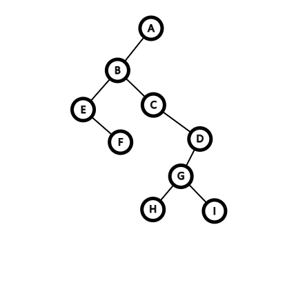

## 1.树的存储

### 1.1.顺序存储

使用一段连续的存储空间，存储所有的树的信息

| index(data) | parent | child1 | child2 | childn |
| ----------- | ------ | ------ | ------ | ------ |
| 0           | -1     | 1      | 2      | -1     |
| 1           | 0      | -1     | -1     | -1     |
| 2           | 0      | -1     | -1     | -1     |

使用结构体定义节点，代码如下：

```cpp
struct node{
    T data;
    int parent;
    int child[k];
} nodes[n];
//k为节点的最大度，n为最大节点数
```

增加节点时：

```cpp
void insert(int x,int y)
{
    for(int i = 0;i < k;i ++)
    {
        if(nodes[x].child[i]==-1)
        {
            nodes[x].child[i]=y;
            break;
        }
    }
    nodes[y].parent = x;
    for(int i = 0;i < k;i ++) nodes[y].child[i] = -1;
}
//省略数据域
```

顺序存储通常适用于树的最大度数确定时，二叉树常用这种方式存储。

在一定情况下，顺序存储可以不存储父节点，或者不存储子节点，也可以还原出整棵树来。

当最大度数不确定时，子节点数难以确定，同时如果节点度数差异较大，则顺序存储会浪费很大空间，此时就需要采取链式存储。

>例题：给出一个最大度数不超过$10$的树，节点从A-Z编号，输入一个数字$n$表示节点数，此后$n-1$行每行两个字母$x,y$表示从$x$到$y$的边。保证第$2$行第一个字母为根节点，所有节点按层次顺序出现。输出它的顺序存储形式。

### 1.2.链式存储

将顺序存储的`child`数组采用链表存储就是链式存储。

节点仅需记录第一个子节点与下一个子节点的编号：

```cpp
struct node{
    T data;
    int parent;
    int head;
    int next;
} nodes[n];
//n为最大节点数
```

插入时，需要找到父节点子节点链表的顶端插入：

```cpp
void insert(int x,int y)
{
    int k = nodes[x].head;
    if(k==-1) nodes[x].head = y;
    else{
    	while(nodes[k].next!=-1) k = nodes[k].next;
    	nodes[k].next = y;
    }
    y.parent = x;
    y.head = -1;
    y.next = -1;
}
```

需要遍历子节点时，则遍历整个链表：

```cpp
int k = nodes[x].head;
while(k!=-1)
{
	//do something
    k = nodes[k].next;
}
```

> 例题：给出一个树，节点从A-Z编号，输入一个数字$n$表示节点数，此后$n-1$行每行两个字母$x,y$表示从$x$到$y$的边。保证第$2$行第一个字母为根节点，所有节点按层次顺序出现。输出$n$行，第$i$行包含第$i$个节点所有子节点对应的字母，中间用空格隔开。

### 1.3.二叉树存储

一般的二叉树通常采用顺序存储，此处不再赘述。

而对于一般的有根树，我们也可以将其按照前文所述的方式转化为二叉树存储。

不难发现，实际上我们将有根树转换为二叉树时也采用了链表的思想，二叉树的左子节点代表在树中的第一个子节点，右子节点则代表树中该节点的兄弟节点，即链表中的下一项，这样一来，将我们链式存储中的链表当成二叉树，就可以得到按照前文规则转化后的二叉树了。

> 例题：给出一个树，节点从A-Z编号，输入一个数字$n$表示节点数，此后$n-1$行每行两个字母$x,y$表示从$x$到$y$的边。保证第$2$行第一个字母为根节点，所有节点按层次顺序出现。输出这棵树转换成二叉树后的顺序存储形式。

## 2.树的遍历

:::tip

本节仅讨论二叉树的遍历，一般的树转换为二叉树再遍历即可。

:::

### 2.1.遍历

二叉树的遍历有三种顺序：

- 前序遍历：根节点，左子树，右子树

- 中序遍历：左子树，根节点，右子树

- 后序遍历：左子树，右子树，根节点

左子节点，右子节点顺序不变，“前”“中”“后”指根节点的位置。

对于每个二叉树，按照这个顺序递归下去就可以得到完整的遍历。

如下图所示二叉树：



前序遍历为：`ABEFCDGHI`

中序遍历为：`EFBCHGIDA`

后序遍历为：`FEHIGDCBA`

体现在代码中，即为操作的顺序：

```cpp
void rab(int x)
{
    if(x==-1) return;
    std::cout << nodes[x].data << ' ';
    rab(nodes[x].lchild);
    rab(nodes[x].rchild);
}//前序遍历
void arb(int x)
{
    if(x==-1) return;
    arb(nodes[x].lchild);
    std::cout << nodes[x].data << ' ';
    arb(nodes[x].rchild);
}//中序遍历
void abr(int x)
{
    if(x==-1) return;
    abr(nodes[x].lchild);
    abr(nodes[x].rchild);
    std::cout << nodes[x].data << ' ';
}//后序遍历
```

> 例题：B3642 二叉树的遍历

### 2.2.还原

根据二叉树的前序遍历和中序遍历或者后序遍历和中序遍历可以唯一还原一棵二叉树。

对于任意一棵树，其中序遍历的第一项就是他的根，接着是它的左子树和右子树，那么根据前序遍历我们就可以确定根节点。

而在中序遍历中，根节点左边就是左子树，根节点右边就是右子树，根据前面确定的根节点，我们就可以得出树的左子树和右子树的中序遍历，再结合子树长度不变，我们就可以得出两个子树的前序遍历，这样我们就可以递归计算两个子树的情况了。

代码实现如下：

```cpp
int build(int rab_index,int arb_index,int len)
{
    if(!len) return -1;
    int root = rab[rab_index];
    int i = 0;
    for(;i < len;i ++) if(arb[arb_index+i]==root) break;
    nodes[root].lchild = build(rab_index+1,arb_index,i);
    nodes[root].rchild = build(rab_index+i+1,arb_index+i+1,len-i-1);
}
```

后序遍历思路与此相同。

> 例题：给出一个节点由大写字母表示的二叉树的前序遍历和中序遍历，求该二叉树的后序遍历。
