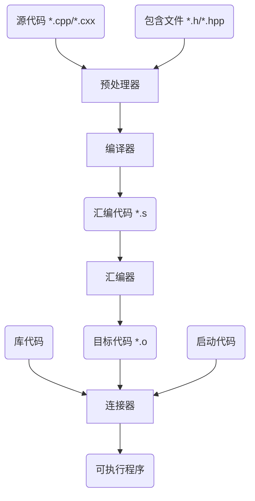

## 1. C++简介

### 1.1. C++简史

- 20世纪70年代，贝尔实验室的Dennins Ritchie为了开发`UNIX`系统而开发了`C`语言
- 20世纪80年代，贝尔实验室的Bjarne Stroustrup为了使`C`语言更易用，在`C`语言的基础上引入了对面向对象编程和泛型编程的支持，发明了`C++`
- 20世纪90年代，ANSI与ISO联合制定了`C++`的第一个标准`ISO/IEC 14882:1998`，并获得了ISO, IEC和ANSI批准，称为`C++98`，在最初的`C++`基础上还加入了`STL`、运行阶段类型识别、模板和异常
- 2003年，`ISO/IEC 14882:2003`发布，主要对上一版进行修订，没有改变语言特性，故常用`C++98`表示`C++98/C++2003`
- 2011年，`ISO/IEC 14882:2011`发布，增加了一些特性，称为`C++11`，也是目前比较常用的版本
- 此后陆续发布的版本有`C++14`、`C++17`、`C++20`、`C++23`、`C++26`

### 1.2. C++的特点

- 编译式

- 结构化

- 底层系统接口

- 面向对象

- 泛型编程

### 1.3. C++的编译器

 `C++`本身只是一个标准，不同硬件平台可以提供自己的编译器以便编译出可以在自己平台上运行的程序，一些组织也开发了比较通用的`C++`编译器，如`g++`，`Clang`，`MSVC`等。

`(类)Unix`平台通常使用`g++`，`Windows`平台下可通过安装`Microsoft Visual Studio`使用`MSVC`，或者使用针对`Windows`平台构建的`GUN`软件包（如`MinGW`）中的`g++`。

### 1.4. g++编译C++程序的流程




### 1.5. g++编译器使用

`Linux`直接使用包管理器安装`gcc`和`g++`

`Windows`安装`MinGW`软件包，常用`MinGW-W64`，可直接从`GitHub`下载预构建版本，安装完成后手动将安装目录下的`bin`目录添加到系统`path`环境变量中。

::github{repo="niXman/mingw-builds-binaries"}

- 基本应用

  ```bash
  g++ t.cpp
  ```

  默认输出`a.out`

  `g++`默认通过扩展名判断编程语言，需要注意源文件拓展名

- 更改输出文件名

  ```bash
  g++ -o t t.cpp
  ```

- 多个输入

  ```bash
  g++ -o t t1.cpp t2.cpp t1.h t2.h t3.o
  ```

  注意，输出为可执行程序时，所有输入（包括目标文件）中必须包含且只包含一个`main`函数

- 只预处理文件

  ```bash
  g++ -E t.cpp
  ```

  直接输出到标准输出，需要保存的请手动重定向

- 只编译代码，不进行汇编

  ```bash
  g++ -S t.cpp
  ```

  输出汇编代码到`*.s`

- 输出目标代码，暂不连接

	```bash
	g++ -c t.cpp
	```

	输出目标代码`*.o`

	目标代码可以在编译时直接作为输入使用，见“多个输入”的示例

	大型工程往往在编译时分出很多目标代码，当某个模块更改时，只用重新编译对应的目标文件，然后重新链接一次，可以大大减少编译时长

- 包含库

  ```bash
  g++ -o t t.cpp -llibrary
  ```

  额外包含库，`l`后面直接加库名称，无空格

  ```bash
  g++ -o t t.cpp -Ldir
  ```

  额外包含库搜索目录，`L`后面直接加目录名称，无空格

- 调试选项

  ```bash
  g++ -o t -g t.cpp
  ```

  输出包含调试信息的程序，调试信息包含变量名，源代码等，使用`gdb`调试器时必须开启该选项

  

- 编译优化

  ```bash
  g++ -o t t.cpp -Ox
  ```

  `x`可选`0,1,2,3`，`0`表示关闭编译优化，`1`为默认等级，`3`为最高等级

  在调试时常关闭优化以保证生成的程序与源文件相同，生成发布版本时开启最高等级以保证运行速度

- 警告输出

  ```bash
  g++ -o t t.cpp -Wall
  ```

  输出所有警告

  ```bash
  g++ -o t t.cpp -Werr
  ```

  把警告视为错误，遇到警告会终止编译

  ```bash
  g++ -o t t.cpp -w
  ```

  忽略所有警告，在编译大型项目时用来快速定位错误

- 动态库选项

  ```bash
  g++ -o t t.cpp -static
  ```

  禁止使用动态库，编译后的程序比较大，但不需要动态库就可以运行

  ```bash
  g++ -o t t.cpp -share
  ```

  尽可能使用动态库，编译后的程序较小，且需要系统的动态库才可以运行

- 语言标准

  ```bash
  g++ -o t t.cpp -std=c++17
  ```

## 2. 关键字与标识符

### 2.1. 关键字

关键字是计算机语言中的词汇，这些词有特殊的意义，不能用作他用。

各标准中出现的`C++`关键字如下

| C++98               |               |                 |           |                  |           |            |          |
| ------------------- | ------------- | --------------- | --------- | ---------------- | --------- | ---------- | -------- |
| and                 | and_eq        | asm             | auto      | bitand           | bitor     | bool       | break    |
| case                | catch         | char            | class     | compl            | const     | const_cast | continue |
| default             | delete        | do              | double    | dynamic_cast     | else      | enum       | explicit |
| export              | extern        | false           | float     | for              | friend    | goto       | if       |
| inline              | int           | long            | mutable   | namespace        | new       | not        | not_eq   |
| private             | protected     | public          | register  | reinterpret_cast | return    | short      | signed   |
| sizeof              | static        | static_cast     | struct    | switch           | template  | this       | throw    |
| true                | try           | typedef         | typeid    | typename         | union     | unsigned   | using    |
| virtual             | void          | volatile        | wchat_t   | while            | xor       | xor_eq     |          |

| C++11               |               |                 |           |                  |           |            |          |
| ------------------- | ------------- | --------------- | --------- | ---------------- | --------- | ---------- | -------- |
| alignas             | alignof       | char16_t        | char32_t  | constexpr        | decltype  | noexcept   | nullptr  |
| static_assert       | thread_local  |                 |           |                  |           |            |          |

| C++20               |               |                 |           |                  |           |            |          |
| ------------------- | ------------- | --------------- | --------- | ---------------- | --------- | ---------- | -------- |
| char8_t             | concept       | consteval       | constinit | co_await         | co_return | co_yield   | requires |

| C++26               |               |                 |           |                  |           |            |          |
| ------------------- | ------------- | --------------- | --------- | ---------------- | --------- | ---------- | -------- |
| contract_assert     |               |                 |           |                  |           |            |          |

| TM TS/reflection TS |               |                 |           |                  |           |            |          |
| ------------------- | ------------- | --------------- | --------- | ---------------- | --------- | ---------- | -------- |
| atomic_cancel       | atomic_commit | atomic_noexcept | reflexpr  | synchronized     |           |            |          |

:::note

`TM TS`和`reflection TS`是非`ISO C++`的`C++`标准，各编译器支持程度不同

:::

### 2.2. 标识符

标识符是用来标记变量，函数名等的符号，通俗讲就是各种“名字”

符合以下规则的是`C++`中的合法标识符

- 只包含大写字母、小写字母（区分大小写）、数字和下划线
- 不能以下划线开头
- 不能是`C++`的关键字
- 理论上没有长度限制，但不同编译器可能会存在长度限制

:::note

由下划线开头的标识符往往是系统使用的，不建议使用下划线开头的标识符

:::

虽然满足上述要求就是合法的标识符，但是不同标识符往往会遵守一些约定俗成的编码规范/命名方案以便于阅读。

## 3. 基本数据类型

### 3.1. 整型


## 4. 语句

## 5. 流程控制

## 6. 运算符

