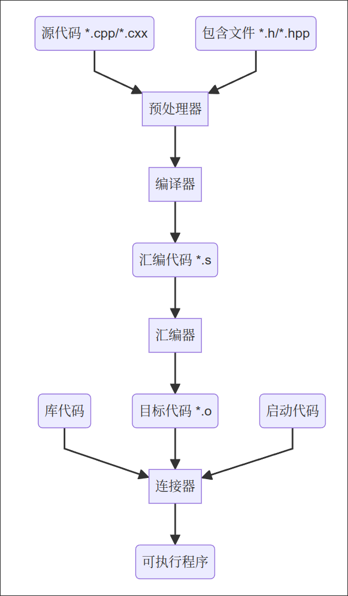

## 1. C++简介

### 1.1. C++简史

- 20世纪70年代，贝尔实验室的Dennins Ritchie为了开发`UNIX`系统而开发了`C`语言
- 20世纪80年代，贝尔实验室的Bjarne Stroustrup为了使`C`语言更易用，在`C`语言的基础上引入了对面向对象编程和泛型编程的支持，发明了`C++`
- 20世纪90年代，ANSI与ISO联合制定了`C++`的第一个标准`ISO/IEC 14882:1998`，并获得了ISO, IEC和ANSI批准，称为`C++98`，在最初的`C++`基础上还加入了`STL`、运行阶段类型识别、模板和异常
- 2003年，`ISO/IEC 14882:2003`发布，主要对上一版进行修订，没有改变语言特性，故常用`C++98`表示`C++98/C++2003`
- 2011年，`ISO/IEC 14882:2011`发布，增加了一些特性，称为`C++11`，也是目前比较常用的版本
- 此后陆续发布的版本有`C++14`、`C++17`、`C++20`、`C++23`、`C++26`

### 1.2. C++的特点

- 编译式

- 结构化

- 底层系统接口

- 面向对象

- 泛型编程

### 1.3. C++的编译器

 `C++`本身只是一个标准，不同硬件平台可以提供自己的编译器以便编译出可以在自己平台上运行的程序，一些组织也开发了比较通用的`C++`编译器，如`g++`，`Clang`，`MSVC`等。

`(类)Unix`平台通常使用`g++`，`Windows`平台下可通过安装`Microsoft Visual Studio`使用`MSVC`，或者使用针对`Windows`平台构建的`GUN`软件包（如`MinGW`）中的`g++`。

### 1.4. g++编译C++程序的流程



### 1.5. g++编译器使用

`Linux`直接使用包管理器安装`gcc`和`g++`

`Windows`安装`MinGW`软件包，常用`MinGW-W64`，可直接从`GitHub`下载预构建版本，安装完成后手动将安装目录下的`bin`目录添加到系统`path`环境变量中。

::github{repo="niXman/mingw-builds-binaries"}

- 基本应用

  ```bash
  g++ t.cpp
  ```

  默认输出`a.out`

  `g++`默认通过扩展名判断编程语言，需要注意源文件拓展名

- 更改输出文件名

  ```bash
  g++ -o t t.cpp
  ```

- 多个输入

  ```bash
  g++ -o t t1.cpp t2.cpp t1.h t2.h t3.o
  ```

  注意，输出为可执行程序时，所有输入（包括目标文件）中必须包含且只包含一个`main`函数

- 只预处理文件

  ```bash
  g++ -E t.cpp
  ```

  直接输出到标准输出，需要保存的请手动重定向

- 只编译代码，不进行汇编

  ```bash
  g++ -S t.cpp
  ```

  输出汇编代码到`*.s`

- 输出目标代码，暂不连接

	```bash
	g++ -c t.cpp
	```

	输出目标代码`*.o`

	目标代码可以在编译时直接作为输入使用，见“多个输入”的示例

	大型工程往往在编译时分出很多目标代码，当某个模块更改时，只用重新编译对应的目标文件，然后重新链接一次，可以大大减少编译时长

- 包含库

  ```bash
  g++ -o t t.cpp -llibrary
  ```

  额外包含库，`l`后面直接加库名称，无空格

  ```bash
  g++ -o t t.cpp -Ldir
  ```

  额外包含库搜索目录，`L`后面直接加目录名称，无空格

- 包含头文件

  ```cpp
  g++ -o t t.cpp -IDIR
  ```

  包含额外头文件搜索目录，指尖括号内系统头文件的搜索路径

- 调试选项

  ```bash
  g++ -o t -g t.cpp
  ```

  输出包含调试信息的程序，调试信息包含变量名，源代码等，使用`gdb`调试器时必须开启该选项

  

- 编译优化

  ```bash
  g++ -o t t.cpp -Ox
  ```

  `x`可选`0,1,2,3`，`0`表示关闭编译优化，`1`为默认等级，`3`为最高等级

  在调试时常关闭优化以保证生成的程序与源文件相同，生成发布版本时开启最高等级以保证运行速度

- 警告输出

  ```bash
  g++ -o t t.cpp -Wall
  ```

  输出所有警告

  ```bash
  g++ -o t t.cpp -Werr
  ```

  把警告视为错误，遇到警告会终止编译

  ```bash
  g++ -o t t.cpp -w
  ```

  忽略所有警告，在编译大型项目时用来快速定位错误

- 动态库选项

  ```bash
  g++ -o t t.cpp -static
  ```

  禁止使用动态库，编译后的程序比较大，但不需要动态库就可以运行

  ```bash
  g++ -o t t.cpp -share
  ```

  尽可能使用动态库，编译后的程序较小，且需要系统的动态库才可以运行

- 语言标准

  ```bash
  g++ -o t t.cpp -std=c++17
  ```

## 2. 关键字与标识符

### 2.1. 关键字

关键字是计算机语言中的词汇，这些词有特殊的意义，不能用作他用。

各标准中出现的`C++`关键字如下

| C++98               |               |                 |           |                  |           |            |          |
| ------------------- | ------------- | --------------- | --------- | ---------------- | --------- | ---------- | -------- |
| and                 | and_eq        | asm             | auto      | bitand           | bitor     | bool       | break    |
| case                | catch         | char            | class     | compl            | const     | const_cast | continue |
| default             | delete        | do              | double    | dynamic_cast     | else      | enum       | explicit |
| export              | extern        | false           | float     | for              | friend    | goto       | if       |
| inline              | int           | long            | mutable   | namespace        | new       | not        | not_eq   |
| private             | protected     | public          | register  | reinterpret_cast | return    | short      | signed   |
| sizeof              | static        | static_cast     | struct    | switch           | template  | this       | throw    |
| true                | try           | typedef         | typeid    | typename         | union     | unsigned   | using    |
| virtual             | void          | volatile        | wchat_t   | while            | xor       | xor_eq     |          |

| C++11               |               |                 |           |                  |           |            |          |
| ------------------- | ------------- | --------------- | --------- | ---------------- | --------- | ---------- | -------- |
| alignas             | alignof       | char16_t        | char32_t  | constexpr        | decltype  | noexcept   | nullptr  |
| static_assert       | thread_local  |                 |           |                  |           |            |          |

| C++20               |               |                 |           |                  |           |            |          |
| ------------------- | ------------- | --------------- | --------- | ---------------- | --------- | ---------- | -------- |
| char8_t             | concept       | consteval       | constinit | co_await         | co_return | co_yield   | requires |

| C++26               |               |                 |           |                  |           |            |          |
| ------------------- | ------------- | --------------- | --------- | ---------------- | --------- | ---------- | -------- |
| contract_assert     |               |                 |           |                  |           |            |          |

| TM TS/reflection TS |               |                 |           |                  |           |            |          |
| ------------------- | ------------- | --------------- | --------- | ---------------- | --------- | ---------- | -------- |
| atomic_cancel       | atomic_commit | atomic_noexcept | reflexpr  | synchronized     |           |            |          |

:::note

`TM TS`和`reflection TS`是非`ISO C++`的`C++`标准，各编译器支持程度不同

:::

:::note

`C++`关键字中有一部分是为了替代特殊符号的运算符而出现的标记符号，功能与运算符完全相同，如下表

 

|   标记   | 含义 |
| :------: | :--: |
|  `and`   | `&&` |
| `and_eq` | `&=` |
| `bitand` | `&`  |
| `bitor`  | `|`  |
| `compl`  | `~`  |
|  `not`   | `!`  |
| `not_eq` | `!=` |
|   `or`   | `||` |
| `or_eq`  | `|=` |
|  `xor`   | `^`  |
| `xor_eq` | `^=` |

:::

### 2.2. 标识符

标识符是用来标记变量，函数名等的符号，通俗讲就是各种“名字”

符合以下规则的是`C++`中的合法标识符

- 只包含大写字母、小写字母（区分大小写）、数字和下划线
- 不能以下划线开头
- 不能是`C++`的关键字
- 理论上没有长度限制，但不同编译器可能会存在长度限制

:::note

由下划线开头的标识符往往是系统使用的，不建议使用下划线开头的标识符

:::

虽然满足上述要求就是合法的标识符，但是不同标识符往往会遵守一些约定俗成的编码规范/命名方案以便于阅读。

## 3. 基本数据类型

### 3.1. 整型

- `char`：1字节
- `short`：至少16位，通常是16位
- `int`：至少与`short`一样长，通常是32位
- `long`：至少32位，且至少与`int`一样长，通常是32位
- `long long`：至少64位，且至少与`long`一样长，通常是64位

:::note

计算机中有符号数常采用补码表示法

正数首位为0，负数首位为1，对于$N$位的补码$-a(0 < a < 2^{N-1})$，其原码表示的数字就是$2^N-a$，这样以来，我们可以轻松处理在0附近从正数减到负数时的退位溢出问题而不用额外考虑复杂的符号变换，同时正数也能兼容无符号数

另一方面，符号不同的补码也可以直接相加，即$a+(-b)=a+(2^N-b)=a-b$，计算机内部计算减法时也可以直接将其转化成负数然后计算，非常易用

当对补码取相反数时，只需将原码按位取反再加1即可

这样一来，原数字变成相反数的过程中，低位的0全部变成1，加上1后一直进位，直到遇见1（取反后是0），那么互为相反数的补码就只有最低位到第一个1的位置是一样的，高位都互为相反数，我们把这个相同的数字叫`lowbits`，即`lowbits=a&(-a)`，数学上是该数字最大的2的幂因子，这个技巧在一些算法中非常有用

根据上面分析不难看出，$N$位补码可表示的范围就是$-2^{N-1} \sim 2^{N-1}-1$，$2^{N-1}-1$上溢后会变成$-2^{N-1}$，反之$-2^{N-1}$下溢就是$2^{N-1}-1$

:::

:::tip

`char`是用来存储字符的数据类型，但也常会被用作存储较小的数字

`char`用来存储`ASCII`字符时，其数字就是字符对应的`ASCII`编码

当`char`用来存储`Uincode`字符时，负数表示该字节与后面的字节构成完整字符，该字节没有达到字符编码的末尾

存储`Unicode`字符还会使用`wchar_t`（一般为`short`，因编译器而异）和`C++11`新增的`char16_t`和`char32_t`

:::

### 3.2. 无符号整型

在上面的有符号整型前加上`unsigned`即为对应的无符号类型

$N$位无符号数的范围即为$0\sim 2^N-1$

实际上，`unsigned`是`unsigned int`的简写，同理，`signed`也是`signed int`的简称，而`short`，`int`，`long`，`long long`实际上是`signed short`，`signed int`，`signed long`，`signed long long`的简写

#### 整型书写方法

- 十进制数：直接书写，无前导0
- 八进制数：含前导0
- 十六进制数：含前导0x
- 不带任何后缀的数字会被存储为`int`，超过`int`范围的会被依次存储为`long`，`long long`
- 带后缀`l/L`，`ll/LL`会分别被存储为`long`，`long long`
- 带后缀`u/U`，`ul/UL`，`ull/ULL`会分别被存储为`unsigned int`，`unsigned long`，`unsigned long long`
- 单个字符使用单引号括起来表示

### 3.3. 浮点数

- `float`：至少32位，通常是32位
- `double`：至少是48位，通常是64位
- `long double`：至少和`double`一样长，通常是128位

:::note

计算机中的小数通常采用浮点表示法，故称为浮点数，数据分为符号位、有效数和指数，浮点数的实际值表示为$(-1)^S\times A\times 2^N$（$S$为符号位，$A$为有效数，$N$为指数），指数按照偏移量的方式处理负数，不同长度的浮点数有不同的分配方式，详见[IEEE 754](https://standards.ieee.org/ieee/754/6210/)标准

:::

#### 浮点数表示法

- 直接表示

- E表示法

  用`E`或`e`加上数字表示小数点移动（十进制），如`1e2`表示`100`，`2.5E-2`表示`0.025`

- 不带任何后缀的浮点数会被存储为`double`类型
- 带后缀`f/F`会被存储为`float`类型
- 带后缀`l/L`会被存储为`long double`类型

:::important

浮点数精度有限，在要求精度较高时会使用整数和固定的指数代替浮点数

:::

### 3.4. 布尔型

- `bool`：1位，表示`true(1)`或`false(0)`

:::tip

对于当前使用的编译器，各种数据类型的最大最小值都作为常量被包含在`climits`头文件中，主要有以下值

||||
| --------- | --------- | ---------- |
| CHAR_BIT  | CHAR_MAX  | CHAR_MIN   |
| SCHAR_MAX | SCHAR_MIN | UCHAR_MAX  |
| SHRT_MAX  | SHRT_MIN  | USHRT_MAX  |
| INT_MAX   | INT_MIN   | UINT_MAX   |
| LONG_MAX  | LONG_MIN  | ULONG_MAX  |
| LLONG_MAX | LLONG_MIN | ULLONG_MAX |

而如果要使用确定长度的变量，可以使用`cints`中的`int8_t`，`int16_t`，`int32_t`和`uint8_t`，`uint16_t`，`uint32_t`及由CPU字长决定的`size_t`

:::

## 4. 运算符

### 4.1. 算术运算符

- `+`：算术加法

- `-`：算术减法
- `*`：算术乘法
- `/`：算术除法，当两个操作数都是整数时，舍去结果的小数部分
- `%`：求模，取余数，操作数必须是整数

#### 4.2. 赋值运算符、组合赋值运算符

- `=`：将右侧值赋给左侧
- `+=`：将左侧变量加上右侧的值
- `-=`：将左侧变量减去右侧的值
- `*=`：同上
- `/=`：同上
- `%=`：同上
- `++`：左/右侧变量自增1，并返回变量原先/更改后的值，根据代码中符号和变量位置关系可以直观判断先运算还是先返回值
- `--`：左/右侧变量自减1，并返回变量原先/更改后的值，根据代码中符号和变量位置关系可以直观判断先运算还是先返回值

#### 4.3. 关系运算符

- `==`：相等
- `<`：小于
- `>`：大于
- `<=`：小于等于
- `>=`：大于等于
- `!=`：不等于

#### 4.4. 逻辑运算符

- `||`：逻辑或
- `&&`：逻辑与
- `!`：逻辑非

#### 4.5. 条件运算符

- `?:`：`condition?expr1:expr2`与`if`语句基本相同，若`condition`为`true`则表达式的值为`expr1`的值，反之则为`expr2`的值，`expr1`和`expr2`必须是相同的类型

#### 4.6. 逗号运算符

- `,`：用于拼接两个表达式，常用在`for`循环中，整个表达式的值是逗号后面的值

#### 4.7. 按位运算符

- `<<`：左移位，右边用0填充，可实现快速乘2
- `>>`：右移位，左边用符号位填充（无符号填充0），可实现快速除2
- `~`：按位取反
- `|`：按位或
- `&`：按位与
- `^`：按位异或

以上按位运算符均可和赋值运算符组成组合赋值运算符

#### 4.8. 其它运算符

- `.`/`->`：成员运算符
- `*`：解引用
- `&`：取地址
- `.*`/`->*`：成员解引用
- `new`：动态分配内存
- `delete`：动态回收内存
- `sizeof`：返回操作数的内存大小（单位字节）
- `alignof`：返回对应类型在内存中的对齐方式
- `noexcept`：指出函数不会引发异常

#### 4.9. 运算符优先级、结合性与顺序点

- 运算符优先级：`C++`运算符有一定的优先级，在一个表达式中有多个运算符时，编译器会优先考虑优先级高的先算，其次考虑结合性，可以使用括号调节优先级
- 运算符结合性：当优先级相同的两个运算符作用于同一个对象时，`C++`会考虑按照结合性从左到右或者从右到左结合，但一般推荐使用括号明确顺序以增加可读性并避免潜在问题
- 顺序点：有的运算符（自增、自减）会产生副作用，调用函数也可能产生副作用，`C++`保证在遇到顺序点时计算出所有的副作用。顺序点包括分号、逗号运算符和完整表达式（不被其它表达式包含的表达式），如`(i++) + (++i)`中，`(i++)`和`(++i)`都不是完整表达式，`C++`不保证在计算加法时计算出任何一者的副作用，该表达式在不同编译器上可能产生不同效果

## 5. 语句

`C++`是由一系列语句组成的命令式语言，每个语句都以`;`结尾

#### 5.1. 声明语句

`type name;`

声明一个变量，程序将根据变量类型分配一块合适的内存空间

也可以声明一个外部变量的引用，此时不会分配内存空间，而是提供一个访问外部变量的名称

多个同类型的变量可以一起声明

`type name1 name2 name3;`

#### 5.2. 赋值语句

`name = value;`

将`value`的值赋给`name`变量，左边必须是一个变量，而右边可以是字面值，也可以是表达式

声明语句和赋值语句可以合并为`type name = value;`

注意多个变量同时声明时，必须单独分别赋值，无法同时赋值，如`type var1 var2 = value;`实际上只给`var2`赋值了

多个赋值语句也可以合并，如`var1 = var2 = var3 = value;`将同时给3个变量赋同样的值

:::tip

在`C++11`中，在赋值和声明语句结合时可以使用`auto`关键字作为类型名，编译器将根据赋值表达式的类型自动推断类型

:::

#### 5.3. 表达式语句

在`C++`中，任何一个合法的表达式，包括函数调用，都可以是一个合法的语句，表达式的值可以被直接忽略

如`1+2;`，`pow(2,2)*3;`

:::note

一般认为表达式都是有值的，故赋值语句一般也认为是赋值表达式

表达式都是语句，但语句不一定是表达式，声明语句就没有对应的值

::::

#### 5.4. 流程控制语句

用于控制程序的运行流程的语句，详见下节

## 6. 流程控制

### 6.1. 分支语句

#### if语句

```cpp 
if(test-condition)
    //if-statement
else
    //else-statement
```

如果`test-condition`为真，执行`if-statement`，否则执行`else-statement`

`else`和`else-statement`可以省略，`if-statement`也可以省略，当然，不能同时省略

`if-statement`和`else-statement`默认只包含一条语句，可以使用大括号来扩展成语句块

`else`后面可以再接`if`，形成多分支结构

#### switch语句

```cpp
switch(integer-expression)
{
    case label1 : statements
    case label2 : statements
        ...
    default : statements
}
```

`switch`接收一个整型表达式，每个`label`为一个整型常量，该语句会匹配所有`label`，并找到相等的执行后面的语句

需要注意的是，不同于`if`，`switch`会执行`case`块中的每一条语句直到下一个`case`，不需要使用大括号，同时也不会停止匹配，这样会降低运行效率，所以需要在`case`块中使用`break;`语句手动跳出`switch`语句

`default`块会匹配任意的表达式值作为默认运行的代码，可以省略，如果没有手动使用`break`，程序可能会再次匹配`default`块，出现运行两次的情况

:::note

实际开发中，分支往往是慢慢添加的，故`switch`语句并不常用，更常用长`if-else`结构，可以方便增加分支，语法更灵活，也不用担心忘记`break;`，如下所示

```cpp
if(condition1)
{   
}else if(condition2)
{
}else{
}
```

:::

### 6.2. 循环语句

#### while语句

```cpp
while(test-condition)
    bady
```

`while`接收一个`test-condition`，若为真则执行`body`，同`if`一样，它只会执行一条语句，可以用大括号让它执行一个语句块

每次循环结束，`while`语句都会重新计算一次`test-condition`，只要`test-condition`为真，它就会一直运行下去

:::note

由于非0值会被转换为`true`的特点，语句`while(T--)`会刚好运行`T`次（`T`是正整数变量），可以简化代码用

:::

有时也会使用`while`的变体`do-while`

```cpp
do
    bady
while(test-condition)
```

该语句会先执行`body`再判断`test-condition`

#### for语句

```cpp
for(init-statement;condition;expression)
    bady
```

该语句会运行一次`init-statement`，然后根据循环条件`condition`的值作为循环条件进入循环，并在每次循环结束时执行一次更新表达式`expression`

实际上相当于以下内容

```cpp
init-statement;
while(condition)
{
    bady
    expression;
}
```

值得注意的是，`init-statement`是一个语句而非表达式，这意味着它可以接受声明语句

`for`常搭配自增/自减运算符使用，如`for(int i = 1;i <= 10;i ++)`将从1到10枚举`i`，并运行10次

`for`循环中`init-statement`和`expression`都可以省略，但是分号不能省略

#### break与continue

`break`和`continue`语句是由单一个关键字组成的流程控制语句

`break`可以跳出循环，用于`while`，`for`和`switch`

`continue`则可以跳过本次循环，直接进入下一次，不过还是要测试对应的循环条件，`for`循环中也会正常运行更新表达式，用于`for`和`while`

`break`和`continue`都只能跳出最内层循环，如果需要跳出多层循环，需要搭配分支语句使用

## 7.注释

注释是程序中用来说明代码的部分，编译时会被去除

养成良好的注释习惯可以帮助自己和他人理解代码

`C++`中有两种注释

- 单行注释：双斜杠`//`后面直到行末的所有内容都会被视为注释
- 多行注释：`/**`和`**/`之间，无论多少行都会被视为注释
